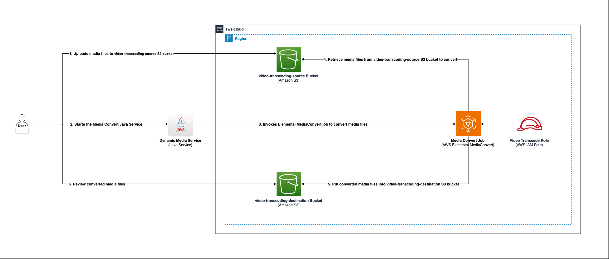
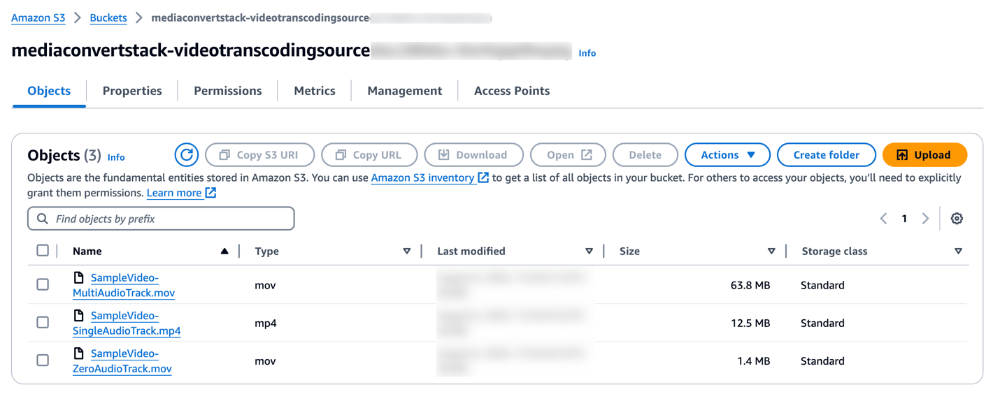

# Dynamically creating AWS Elemental MediaConvert job settings

This repository contains both the service used for Java Media Convert Service and the [CDK template](cdk) to help quickly create the infrastructure required to run the service. This service explores how the job settings in [AWS Elemental MediaConvert](https://aws.amazon.com/mediaconvert/) can be dynamically configured. Specifically, demonstrating the ability to programmatically configure the audio tracks while transcoding the video files. The video files that have been transcoded using the configured settings can then be utilized for various purposes, such as playback on different media devices like Windows Media Player, as part of the quality assurance process or integrated into other business workflows.

# Architectural Diagram


# Project Structure
* **cdk/lib/MediaConvertStack.ts** \- CDK Stack to deploy the infrastructure for this example.
* **service/test/** \- Test for the Java Media Convert Service.
* **service/src** \- Java Media Convert Service that will transcode the video files.

## Product Versions
- AWS SDK For Java v2.21.20
- AWS CDK v2.140.0
- Amazon Corretto v17, distribution of Open JDK 

## Prerequisite
- Install `Amazon Corretto 17` using the OS based instructions outlined [here](https://docs.aws.amazon.com/corretto/latest/corretto-17-ug/what-is-corretto-17.html) if not already installed
- AWS Account with AWS Identity and Access Management (IAM) permissions to access AWS CloudFormation, AWS IAM and create
  necessary services.
- AWS CDK Toolkit
  If it is not already installed, install it using following commands.
    ```
    npm install -g aws-cdk
    ```
  If AWS CDK Toolkit version is earlier than 2.140.0, then enter the following command to update it to version 2.140.0.
    ```
    npm install -g aws-cdk@2.140.0 --force
    ```

## Setup
- Clone the repository on your local machine.
```
git clone <<repository url>>
```
- On Terminal window navigate to cdk folder and run the following commands.
```
cd cdk
```
- Install CDK dependencies 
```
npm install
```
- Export environment variables
```
export AWS_REGION=<<region>>
export AWS_ACCOUNT=<<account>>
```
## Deploy
- Configure AWS credentials
- Following step is required for the first time to bootstrap the CDK environment.
  This step is optional for the successive deployments.
```
npx cdk bootstrap
```
- Deploy the AWS resources using the mediaconvert CDK stack to your AWS account 
```
npx cdk deploy
```

### Output

This will output the following AWS resources:
- `mediaconvertstack-videotranscodingsourceXXXXX` S3 Bucket: where the video files are uploaded and transcoded.
-	`mediaconvertstack-videotranscodingdestinationXXXXX` S3 Bucket: where the video files are sent after transcoding.
-	mediaConvert Elemental Media Job Queue: This is where Java application submits the media convert job to.
-	mediaConvert IAM Role: Role and the IAM permissions required for the AWS Elemental MediaConvert service to run the job needed for read and write permissions to source and destination buckets.

## Testing
- Download sample video files ([file_example_MOV_1280_1_4MB.mov](https://file-examples.com/storage/fee7a7e285671bd4a9d4d9d/2018/04/file_example_MOV_1280_1_4MB.mov), [1080i60_SMPTE_8CH_audible.mov](https://drive.google.com/file/d/1n2MieRbulM1AvM5AUfteRpKy2S2b5I4F/view) and [2122934-hd_1920_1080_30fps.mp4](https://www.pexels.com/video/wind-chime-hanging-on-a-tree-2122934/)) required for testing the service.
-	Rename sample files from previous step to `SampleVideo-ZeroAudioTrack.mov`, `SampleVideo-MultiAudioTrack.mov`, `SampleVideo-SingleAudioTrack.mp4` and respectively.
-	Upload files
	- Log into AWS Management Console.
	- Navigate to Amazon S3 service -> bucket starts with the string `mediaconvertstack-videotranscodingsource` and upload the sample files `SampleVideo-ZeroAudioTrack.mov`, `SampleVideo-SingleAudioTrack.mp4` and `SampleVideo-MultiAudioTrack.mov` using `Upload` button.
	- It should be as below

- Update the [config.properties](service/src/test/resources/config.properties) file with values for `region`, `mcRoleArn`, `mcQueueArn`, `sourceBucket` and `destinationBucket` obtained from [Deploy step](#output)
- Run MCDynamicAudioTest class to start transcoding of the files present in the bucket that starts with `mediaconvertstack-videotranscodingsource` S3 Bucket.  This will run the Dynamic Media Service to dynamically configure the number of audio tracks
```
cd ../service
mvn test
```
### Job Ids
Expected output when the tests have been successfully run
```
Media Convert Job Id xxxxxxxxx-68qrfl
Test CreateJob passed

Media Convert Job Id xxxxxxxxx-79oikl
Test CreateJob passed

Media Convert Job Id xxxxxxxxx-34rvy6
Test CreateJob passed
```
## Validation
- Check whether submitted jobs are completed
	- Log into AWS Management Console.
  - Navigate to AWS Elemental MediaConvert and then to Jobs.
  - Locate the Job IDs for the files that you submitted in [Job Ids](#job-ids)
  - Confirm that the Job IDs all have a status of COMPLETE.
-	Once transcoding is done, validate your files are transcoded in the bucket that starts with  `mediaconvertstack-videotranscodingdestination`.

## Cleanup
To delete the stack and all associated resources, run below command.

Note: The S3 buckets for both the source and destination have removalPolicy configured. As a result, when the MediaConvertStack.ts stack is destroyed, all files and buckets will be automatically deleted.

Navigate to `cdk` folder on terminal window and run the following command.
```
cd ../cdk
npx cdk destroy
```
This command will remove the following resources:
- AWS Elemental MediaConvert job queue
- Two Amazon S3 buckets (source and destination)
- IAM role and policies

## Security

See [CONTRIBUTING](CONTRIBUTING.md#security-issue-notifications) for more information.

## License

This library is licensed under the MIT-0 License. See the LICENSE file.